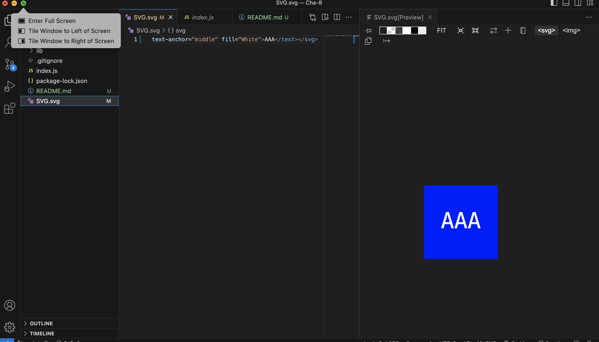

# SVG File Generator

## Description

This application generates an SVG file based on user input.

## Installation

To install, git clone code from the github repository.

## Usage

## Screenshot

## Credits

Skyler Keeling

## License

MIT

 
https://www.mit.edu/~amini/LICENSE.md

## Features

Can generate an SVG file with different text, colours and shapes.

## Personal

https://github.com/SkylerKeeling
